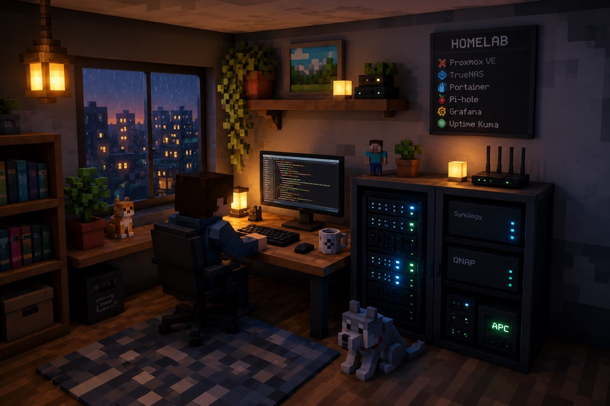

  

# Hi there, I'm Dung 👋

## AI/ML Systems Architect | Infrastructure & MLOps | Language Technology

I own AI infrastructure end-to-end — from cloud provisioning to production ML serving. CLI-first, cost-conscious, and framework-driven in every decision.

📄 [CV](https://portfolio-dungca.ai-innovation-homelab.org/CV_CongAnhDung.pdf) · 🌐 [Portfolio](https://portfolio-dungca.ai-innovation-homelab.org) · ✍️ [Blog](https://blog-dungca.ai-innovation-homelab.org) · 🤗 [Hugging Face](https://huggingface.co/dungca)

### What I Build

- **Production ML Serving**  
  ASR (faster-whisper/CTranslate2), TTS, pronunciation scoring (wav2vec2 CTC + GOP), and embedding (Qwen3) services for users across VN, JP, and KR — including a self-hosted OpenAI-compatible `/v1/embeddings` endpoint that replaced the paid API.
- **Cloud & Kubernetes Infrastructure**  
  Terraform/Ansible provisioning, Docker/Compose/Swarm, and Kubernetes on GKE, DigitalOcean, and bare-metal kubeadm — with ArgoCD GitOps, MetalLB, and Cloudflare Tunnel.
- **Infrastructure as Code, All the Way Home**  
  Even the Raspberry Pi that serves my LAN is a single idempotent Ansible playbook: rebuildable from a bare OS, DNS latency cut **199 ms → 27 ms**, operated through Slack ChatOps on a Cloudflare Worker.
- **Cost Engineering**  
  Size hardware from benchmarks, not vendor slides: a measured **p95 of 1.86 s at 20 concurrent users** (~8% GPU utilization, ~2 GB VRAM) showed a commodity CUDA GPU was enough where an H100 plan would have cost ~$2,475/mo — and ruled out CPU-only serving with a ~1 req/s throughput wall.

### Selected Projects

- [homelab](https://github.com/dungca1512/homelab) — 3-node Kubernetes v1.31 built by hand with `kubeadm`, GitOps via ArgoCD App-of-Apps, Prometheus + Loki, ~2,400 lines of engineering notes
- [ai-gateway](https://github.com/dungca1512/ai-gateway) — reactive multi-provider LLM gateway (Spring WebFlux + FastAPI worker), provisioned on GKE Autopilot with Terraform
- [whisper-finetune-ja](https://github.com/dungca1512/whisper-finetune-ja) — Japanese ASR fine-tuning with a full CI/CT/CD loop; [3 models on Hugging Face](https://huggingface.co/dungca), LoRA variant at 40+ downloads
- [newspulse-reco-engine](https://github.com/dungca1512/newspulse-reco-engine) — Kafka/Spark streaming news platform (Scala)
- [research-agent](https://github.com/dungca1512/research-agent) — LangChain + LangGraph research workflows
- *Raspberry Pi homelab (private)* — Ansible IaC, AdGuard Home DNS with DoH, Slack ChatOps, ansible-lint/yamllint/gitleaks CI gates, GPG-encrypted backups

### Tech Stack

#### Infrastructure & DevOps

#### Observability

#### Cloud

#### Languages

#### AI/ML & Serving

### Research Interests

- Cost-efficient ML model serving and GPU utilization
- Production LLM reliability and orchestration at scale
- GitOps and reproducible infrastructure for ML platforms
- Southeast Asian & East Asian language processing

### Currently Learning

- AWS Solutions Architect Associate (SAA-C03) — in progress
- Advanced GitOps patterns (ArgoCD App-of-Apps) and observability at scale
- Efficient model serving and protocol design for AI gateways
- Treating home infrastructure like production: Ansible IaC, ChatOps, and recovery runbooks

### Let's Connect

- Email: **dungca1512@gmail.com**
- GitHub: **[dungca1512](https://github.com/dungca1512)**
- LinkedIn: **[dungca](https://www.linkedin.com/in/dungca/)**

---

*Building practical bridges between frontier AI research and production-grade infrastructure.*
